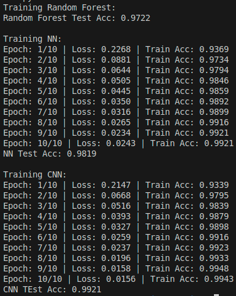

# MNIST Classifier Implementation

## Overview

This project implements three different approaches to classify MNIST handwritten digits:

- Random Forest Classifier
- Neural Network
- Convolutional Neural Network (CNN)

## Features

- Abstract base class `MnistClassifierInterface` defining the common interface
- Three classifier implementations:
  - `RandomForestMnistClassifier`: Using scikit-learn's RandomForestClassifier
  - `NeuralNetworkMnistClassifier`: Custom neural network using PyTorch
  - `ConvolutionalMnistClassifier`: CNN architecture for improved accuracy
- Unified `MnistClassifier` wrapper class for easy model selection

## Requirements

- Python 3.x
- PyTorch
- NumPy
- scikit-learn
- torchvision

## Usage

```python
from MnistClassifier import MnistClassifier

# Initialize with desired algorithm ('rf', 'nn', or 'cnn')
classifier = MnistClassifier(algorithm='cnn')

# Train the model
classifier.train(X_train, y_train)

# Make predictions
predictions = classifier.predict(X_test)
```

## Model Architectures

### Neural Network

- Input layer (784 nodes)
- Hidden layers: 256 → 128 → 64 nodes
- Batch normalization and dropout for regularization
- Output layer (10 nodes)

### CNN

- 2 convolutional layers with max pooling
- Fully connected layers: 64*7*7 → 128 → 10
- Dropout for regularization

## Training

The script includes a complete example that:

1. Loads the MNIST dataset
2. Preprocesses the data
3. Trains all three models
4. Evaluates and compares their performance

## Output


